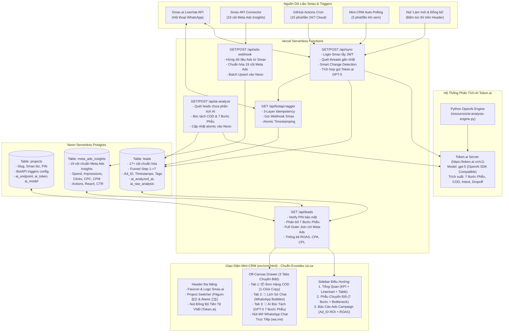

# Smax WhatsApp Livechat & Meta Ads to Vercel/Neon Mini-CRM & AI Automation

## 1. Goal

Thay thế 100% luồng Google Sheet & Google Apps Script bằng **hệ thống Mini-CRM độc lập, tốc độ cao trên Vercel Serverless Functions + Neon Serverless Postgres**, tích hợp **AI Server Token.ai (GPT-5)** phân tích ngữ nghĩa sâu hội thoại WhatsApp, **đồng bộ dữ liệu Meta Ads Insights (19 cột)** từ Smax API Connector, **chuẩn hóa tiền tệ đa quốc gia về VNĐ** để tính ROAS chính xác, và **áp dụng chuẩn thiết kế UI/UX Evondev cao cấp cùng nhận diện thương hiệu Smax.ai**.

Hệ thống cung cấp:
1. **Zero Quota Limits**: Lưu trữ không giới hạn hội thoại và bản ghi quảng cáo trên Postgres, loại bỏ hoàn toàn giới hạn 500KB và 6 phút timeout của Google Apps Script.
2. **Multi-Tenant & Instant Project Switcher**: Một hệ thống duy nhất quản lý hàng chục dự án thông qua URL slug riêng biệt (`https://your-crm.vercel.app/{project_id}`) kèm mã PIN bảo mật và menu chuyển đổi dự án tức thì trên Header (ví dụ: Fitgum Malaysia 🇲🇾 và Abera Indonesia 🇮🇩).
3. **Chuẩn Thiết Kế UI/UX Evondev & Smax Branding**: Tích hợp favicon & logo chính thức của Smax.ai (`https://i.ibb.co/tTXsDCSP/LOGO-SMAX-AI-MOBLE-N-N-TR-NG-08.png`), bộ font đôi `Plus Jakarta Sans` + `JetBrains Mono`, đổ bóng nhẹ `shadow-xs/sm`, và Off-canvas Drawer 3 tab chuyên biệt (`[ 📦 Đơn Hàng COD ]`, `[ 💬 Lịch Sử Chat ]`, `[ 🧠 AI Bóc Tách ]`) kèm nút nhảy thẳng vào WhatsApp (`wa.me/{phone}`).
4. **Tự Động Kích Hoạt AI Token.ai (GPT-5)**: Ngay khi dự án mới được khởi tạo trên Neon Postgres, hệ thống AI Server Token.ai (`https://token.ai.vn/v1`, Model `gpt-5`) được tự động kích hoạt để bóc tách nhu cầu, địa chỉ COD, phân loại phễu và điểm nghẽn.
5. **Hỗ Trợ Toàn Diện OpenAI SDK Python & Node.js**: Cung cấp module chuẩn OpenAI SDK Python độc lập (`resources/ai-analysis-engine.py`) và tích hợp trực tiếp trong Vercel Serverless Engine.
6. **Phễu Chuyển Đổi 7 Bước (/whatsapp-funnel-engine)**: Tự động phân loại từng hội thoại vào 7 nấc phễu và chẩn đoán điểm nghẽn (bottlenecks).
7. **Đồng Bộ Dữ Liệu Báo Cáo Meta Ads (19 Cột Chuẩn)**: Tiếp nhận dữ liệu Meta Ads Insights từ Smax API Connector qua endpoint Vercel Webhook (`api/ads-webhook.js`), lưu trữ vào bảng `meta_ads_insights`.
8. **Đối Soát Quảng Cáo & Hội Thoại Toàn Diện (Attribution Join)**: Tự động `FULL OUTER JOIN` giữa bảng `leads` và `meta_ads_insights` theo `ad_id` để đo lường chính xác **ROAS, Blended CPA, CPL** và phát hiện các mẫu quảng cáo chuyển đổi cao (Top Converters) hoặc chi tiêu nhiều mà không ra đơn.
9. **Chuẩn Hóa Tiền Tệ Đa Quốc Gia Về VNĐ Bằng Token.ai (3 Bước)**: Xóa bỏ sự lệch pha giữa tiền tài khoản Ads (VND, USD) và tiền thu COD thị trường (RM, IDR, THB). Tự động lấy tỷ giá thị trường thực tế qua Token.ai GPT-5 để quy đổi đồng bộ và tính toán ROAS, CPA, CPL chuẩn xác 100%.
10. **Cơ Chế Đồng Bộ 3 Tầng Dự Phòng (Triple Redundancy)**: Tự động quét 15 phút/lần 24/7 bằng GitHub Actions, quét ngầm 3 phút/lần khi mở trình duyệt, và hỗ trợ quét tức thì.
11. **Dual BotAPI Gắn Tag Chống Trùng Lặp 3 Tầng (Strict Idempotency)**: Gắn tag `"Thành công"` và `"Có nhu cầu"` trên Smax chỉ đúng 1 lần duy nhất.

---

## 2. Kiến Trúc Luồng Dữ Liệu (System Architecture)



---

## 3. Quy Trình Triển Khai Chuẩn (Standard Operating Procedure)

### Bước 1: Khởi Tạo Database Schema Trên Neon Postgres
1. Đăng ký/đăng nhập Neon Serverless Postgres, tạo database `neondb`.
2. Chạy file SQL khởi tạo cấu trúc bảng từ [`resources/neon-schema.sql`](resources/neon-schema.sql):
   - Bảng `projects`: Thông tin kết nối Smax, mã PIN, URLs BotAPI, và **Cấu hình AI Server Token.ai** (`ai_endpoint`, `ai_token`, `ai_model`, `ai_enabled`).
   - Bảng `leads`: 17 trường kinh doanh, cột `ad_id`, `funnel_step`, `funnel_step_num`, `tags`, `tagged_success_at`, `tagged_demand_at`, `ai_analyzed_at`, `ai_raw_analysis`.
   - Bảng `meta_ads_insights`: 19 trường chuẩn Meta Ads Insights (`date`, `account_id`, `campaign_id`, `campaign_name`, `adset_id`, `adset_name`, `ad_id`, `ad_name`, `actions`, `spend`, `click_rate`, `cpc`, `reach`, `frequency`, `inline_link_clicks`, `inline_post_engagement`, `clicks`, `impressions`, `cpm`).
   - Ràng buộc duy nhất `CONSTRAINT uq_meta_ads_entry UNIQUE (project_id, date, ad_id, adset_id, campaign_id)` kèm chỉ mục tối ưu truy vấn.
3. Chèn bản ghi dự án mới (Mặc định tự động kích hoạt Token.ai GPT-5):
```sql
INSERT INTO projects (
  id, name, currency, smax_biz, smax_page_pid, access_pin,
  botapi_success_url, botapi_demand_url,
  ai_endpoint, ai_token, ai_model, ai_enabled
) VALUES (
  'fitgum', 'Fitgum Acai Berry Drink Malaysia', 'RM', 'phuong-hoang', 'wa1241941005679303', '1609',
  'https://api.smax.ai/public/bizs/phuong-hoang/triggers/6ab7763fa8aaf89064b013e0',
  'https://api.smax.ai/public/bizs/phuong-hoang/triggers/6ab77d5082c64cb43bc6379b',
  'https://token.ai.vn/v1',
  'sk-LEd49hmmEG9L4kB_aYYGhHHJirAsbtLkmyNReBe_yYgv3IRtAIhp8vJ_hjE',
  'gpt-5',
  TRUE
);
```

---

### Bước 2: Thiết Lập & Tự Động Kích Hoạt Token.ai AI Server (GPT-5)

Mỗi khi dự án mới được khởi tạo, hệ thống mặc định gán cấu hình Token.ai AI Server:
- **Base URL**: `https://token.ai.vn/v1`
- **Token**: `sk-LEd49hmmEG9L4kB_aYYGhHHJirAsbtLkmyNReBe_yYgv3IRtAIhp8vJ_hjE`
- **Model**: `gpt-5`
- **Protocol**: Chuẩn OpenAI SDK Chat Completions (`response_format: {"type": "json_object"}`).

#### 1. Kết Nối Bằng OpenAI SDK Python (`resources/ai-analysis-engine.py`):
```python
from openai import OpenAI

client = OpenAI(
    base_url="https://token.ai.vn/v1",
    api_key="sk-LEd49hmmEG9L4kB_aYYGhHHJirAsbtLkmyNReBe_yYgv3IRtAIhp8vJ_hjE"
)

response = client.chat.completions.create(
    model="gpt-5",
    messages=[
        {"role": "system", "content": SYSTEM_ANALYSIS_PROMPT},
        {"role": "user", "content": f"Khách hàng: {customer_name}\n\nTranscript:\n{transcript}"}
    ],
    temperature=0.1,
    response_format={"type": "json_object"}
)
result = json.loads(response.choices[0].message.content)
```

#### 2. Dữ Liệu Bóc Tách Chuẩn Từ GPT-5:
- `main_intent`: Nhu cầu cốt lõi (5-10 từ).
- `conversation_result`: `Đã chốt đơn` | `Có nhu cầu` | `Đang tư vấn` | `Chưa phản hồi`.
- `is_order_closed`: Boolean (chỉ true khi khách chốt mua combo và đã cung cấp địa chỉ nhận hàng COD).
- `is_high_intent`: Boolean (true khi khách hỏi giá cụ thể, hỏi ship COD, chọn combo hoặc gửi thông tin nhận hàng).
- `order_combo`: Tên combo (ví dụ: `Combo 1 (Buy 3 Get 3 FREE)`).
- `order_amount`: Số tiền COD.
- `recipient_name`, `recipient_phone`, `shipping_address`: Thông tin giao hàng COD đầy đủ.
- `order_details`: Chuỗi card COD định dạng `📦 [Combo] ([Tiền]) | 👤 Người nhận: [Tên] | 📞 [SĐT] | 📍 Địa chỉ: [Địa chỉ] | 🚚 COD Free Shipping`.
- `dropoff_reason`: Điểm nghẽn rớt khách.
- `funnel_step` & `funnel_step_num`: Phân loại chính xác 1 trong 7 bước phễu.

---

### Bước 3: Triển Khai Serverless Endpoints Trên Vercel
Cấu hình 5 endpoint serverless Node.js trong thư mục `api/`:

1. **`api/sync.js` (Đồng bộ Smax $\rightarrow$ Token.ai $\rightarrow$ Neon)**:
   - Đăng nhập Smax lấy JWT qua HTTP Basic Auth.
   - Lấy danh sách hội thoại mới nhất (`POST /bizs/{biz}/threads`).
   - **Smart Change Detection**: So sánh `thread.last_message_at` với DB `last_msg_at` để tối ưu thời gian dưới 3 giây.
   - **Lọc sạch tin hệ thống**: Bỏ qua các sự kiện bàn giao Meta Business AI.
   - **Tích hợp Token.ai GPT-5**: Phân tích tức thì hội thoại có tin nhắn mới, tự động bóc tách COD, intent và phễu 7 bước.
   - Ghi đè an toàn vào Neon Postgres bằng `ON CONFLICT (project_id, tid) DO UPDATE`.

2. **`api/ai-analyze.js` (Phân tích AI hàng loạt chuyên sâu)**:
   - Quét các leads trong DB thỏa điều kiện `ai_analyzed_at IS NULL AND customer_messages > 0`.
   - Gọi Token.ai GPT-5 tuần tự/batch an toàn.
   - Cập nhật kết quả phân tích JSON (`ai_raw_analysis`) và gán mốc thời gian `ai_analyzed_at = NOW()`.

3. **`api/ads-webhook.js` (Hứng dữ liệu quảng cáo Meta Ads từ Smax API Connector)**:
   - Xử lý kiểm tra kết nối từ Smax (Healthcheck Ping: phản hồi HTTP 200).
   - Làm sạch ký tự tiền tệ (`RM`, `$`, `₫`) và phần trăm (`%`).
   - Chuẩn hóa ngày về `YYYY-MM-DD`.
   - Thực thi Idempotent Batch Upsert vào bảng `meta_ads_insights`.

4. **`api/leads.js` (Truy vấn CRM & Phân tích tổng hợp)**:
   - Xác thực mã PIN dự án.
   - Phân bổ 7 bước phễu (`funnelStats`) và phát hiện Điểm nghẽn lớn nhất.
   - **Attribution Join**: `FULL OUTER JOIN` giữa `leads` và `meta_ads_insights` theo `ad_id` để tính toán ROAS, Blended CPA, CPL.
   - Hỗ trợ sắp xếp: mặc định `last_msg_desc` (tin nhắn mới nhất lên đầu), `last_msg_asc`, `first_msg_desc`, `first_msg_asc`.
   - Hỗ trợ tìm kiếm theo `customer_name`, `phone`, `order_details`, và **`ad_id`**.

5. **`api/botapi-tagger.js` (Gắn thẻ tự động 3 tầng Idempotency)**:
   - Tuân thủ nghiêm ngặt [`resources/botapi-tagging-rules.md`](resources/botapi-tagging-rules.md).
   - Lọc các lead thỏa điều kiện nhưng `tagged_*_at IS NULL`.
   - Bắn HTTP GET tới Smax Trigger kèm mã hóa URL an toàn.
   - Ghi nhận `tagged_*_at = NOW()` sau khi nhận HTTP 200.

---

### Bước 4: Thiết Lập Smax API Connector Đẩy Dữ Liệu Meta Ads
Theo tài liệu chi tiết tại [`resources/smax-ads-connector-setup.md`](resources/smax-ads-connector-setup.md):
1. Trên giao diện Smax: **Cài đặt** $\rightarrow$ **Kết nối** $\rightarrow$ **API Connector** $\rightarrow$ **Thêm kết nối mới**.
2. Chọn biểu tượng **`API`**.
3. Điền Webhook URL:
   ```text
   https://your-crm.vercel.app/api/ads-webhook?project_id={id}
   ```
4. Chọn Phương thức: `POST`, Xác thực: `None`.
5. Bấm **Lưu kết nối**. Endpoint tự động trả về HTTP 200 giúp kết nối thành công 100%.

---

### Bước 5: Thiết Lập GitHub Actions 15-Phút Cron 24/7
Tạo file `.github/workflows/smax-sync-cron.yml` theo [`resources/github-cron-setup.md`](resources/github-cron-setup.md).
- Schedule: `*/15 * * * *` (mỗi 15 phút một lần).
- Thực thi `curl` tự động ping vào `https://your-crm.vercel.app/api/sync?project_id={id}` và `/api/botapi-tagger`.
- Hoàn toàn miễn phí, độc lập, không phụ thuộc vào máy tính cá nhân.

---

### Bước 6: Triển Khai Giao Diện Mini-CRM Dashboard
Sử dụng file template `src/crm.html` với kiến trúc 3 tab chính trên Sidebar:

1. **Tab 1: Tổng Quan (Overview)**:
   - 4 Thẻ KPI: Đơn chốt thành công (Doanh thu), Có nhu cầu cao, Đang tư vấn, Tổng số lead.
   - Biểu đồ biến động số lượng lead theo ngày.
   - Bảng hội thoại với đầy đủ các cột: *Khách hàng, Mã Ad (Ad_ID), Phễu 7 Bước, Trạng thái (kèm badge Smax BotAPI), Nhu cầu chính, Đơn hàng/Báo giá, Lần đầu nhắn, Lần cuối nhắn*.
   - Cho phép click vào Ad_ID hoặc Bước phễu để lọc danh sách tức thì.
   - Drawer xem lịch sử chat và thẻ chi tiết đơn hàng COD có nút 1-click copy thông tin giao hàng.

2. **Tab 2: Phễu Chuyển Đổi (7-Step Funnel)**:
   - Hiển thị trực quan 7 thanh tiến trình phần trăm theo [`resources/funnel-7-steps-mapping.md`](resources/funnel-7-steps-mapping.md).
   - Khung cảnh báo **Điểm Nghẽn AI Phát Hiện**: Nêu rõ giai đoạn có tỷ lệ rớt khách cao nhất (ví dụ: Bước 4 Báo giá) kèm 2 hộp giải pháp khắc phục kịch bản.

3. **Tab 3: Báo Cáo Theo Ads Campaign & ROAS**:
   - **Khu Vực Đồng Bộ Tiền Tệ 3 Bước (Token.ai GPT-5 Engine)**:
     - Bước 1: Chọn đồng tiền tài khoản Ads (Spend: VND, USD, RM, IDR...).
     - Bước 2: Chọn đồng tiền doanh thu CRM (Orders: RM, IDR, VND, USD...).
     - Bước 3: Bấm nút "Đồng bộ về VNĐ" (gọi Token.ai AI Server tự động cập nhật tỷ giá thị trường và refresh hợp nhất toàn bộ dữ liệu về VNĐ để tính ROAS chính xác).
     - Hỗ trợ công tắc xem: `[VNĐ (Chuẩn hóa)]` vs `[Gốc]`.
   - **Hộp Hướng Dẫn Smax API Connector**: Cung cấp URL Webhook kèm nút 1-click copy để dán vào Smax.
   - **4 Thẻ Executive KPI**: Tổng Chi Tiêu (Spend), Doanh Thu & ROAS, Blended CPA, Chi Phí Trên Mỗi Lead (CPL) & CPC.
   - **Khung Đề Xuất AI Tối Ưu Ngân Sách**: Phát hiện Top Converter có ROAS cao nhất và cảnh báo chiến dịch chi tiêu nhiều mà chưa ra đơn.
   - **Bảng Đối Soát Chi Tiết 13 Cột**: Spend, Impressions, Clicks, CTR, CPC, CPM, Leads, Hot Leads, Đơn Chốt, Doanh Thu, CPL, ROAS.
   - **2 Biểu Đồ Trực Quan (Chart.js)**: Chi tiêu vs Doanh thu theo Ad, và Tương quan Tổng Lead vs Lead Tiềm Năng.

---

### Bước 7: Cấu Hình Định Tuyến & Deploy Vercel
Cấu hình file `vercel.json`:
```json
{
  "version": 2,
  "outputDirectory": "src",
  "cleanUrls": true,
  "functions": {
    "api/sync.js": { "maxDuration": 60 },
    "api/ai-analyze.js": { "maxDuration": 60 },
    "api/ads-webhook.js": { "maxDuration": 30 },
    "api/ads.js": { "maxDuration": 30 },
    "api/currency-sync.js": { "maxDuration": 30 },
    "api/leads.js": { "maxDuration": 30 },
    "api/botapi-tagger.js": { "maxDuration": 30 }
  },
  "crons": [
    { "path": "/api/sync?project_id=fitgum", "schedule": "0 0 * * *" }
  ],
  "rewrites": [
    { "source": "/api/(.*)", "destination": "/api/$1" },
    { "source": "/crm/(.*)", "destination": "/crm" },
    { "source": "/fitgum", "destination": "/crm" },
    { "source": "/:project", "destination": "/crm" }
  ]
}
```
Deploy lệnh:
```bash
npx vercel --prod --yes
```

---

### Bước 8: Chuẩn Hóa Giao Diện UI/UX Dashboard Theo Evondev & Nhận Diện Smax.ai
1. **Logo & Favicon Chuẩn**:
   - Sử dụng favicon chính thức của Smax: `https://i.ibb.co/tTXsDCSP/LOGO-SMAX-AI-MOBLE-N-N-TR-NG-08.png`.
   - Giữ nguyên ảnh logo trên Header, không dùng chữ ký tự đầu (initials) đè lên ảnh.
2. **Typography & Bố Cục Thẻ (Evondev /ui-ux)**:
   - Import font `Plus Jakarta Sans` cho toàn bộ văn bản và `JetBrains Mono` cho số điện thoại, Ad_ID, tiền tệ, thời gian.
   - Thẻ hiển thị màu nền trắng `bg-white`, viền `border-slate-200/80`, bo góc mềm `rounded-2xl`, bóng mờ tinh tế `shadow-xs` / `shadow-sm` (tuyệt đối không dùng bóng đậm đen thô kệch).
3. **Bộ Chuyển Đổi Dự Án Tức Thì (Instant Project Switcher)**:
   - Dropdown trên Top Header và Sidebar cho phép chuyển đổi mượt mà giữa các thị trường đang chạy (ví dụ: Fitgum Malaysia 🇲🇾 và Abera Indonesia 🇮🇩).
   - Tự động lưu và nhận diện PIN đăng nhập độc lập cho từng dự án, cập nhật tức thì cờ quốc gia, đơn vị tiền tệ (`RM` hoặc `IDR`) và mẫu Webhook URL.
4. **Off-Canvas Drawer 3 Tabs Chuyên Biệt**:
   - **Nút Mở WhatsApp Chat Trực Tiếp**: Mở `https://wa.me/{cleanPhone}` trong tab mới để nhân viên sale phản hồi tức khắc.
   - **Tab 1: 📦 Đơn Hàng COD**: Hiển thị thẻ đơn hàng đầy đủ, thông tin người nhận, địa chỉ giao hàng, số tiền COD, và nút 1-click copy địa chỉ tiện lợi cho khâu vận chuyển.
   - **Tab 2: 💬 Lịch Sử Chat**: Dựng bong bóng tin nhắn WhatsApp phân tách rõ ràng giữa Tư vấn viên (`Customer Service / Smax AI`) và Khách hàng (`Customer`), kèm thời gian gửi chuẩn.
   - **Tab 3: 🧠 AI Bóc Tách**: Báo cáo phân tích chuyên sâu của Token.ai GPT-5 (Bước phễu hiện tại, Bằng chứng trích dẫn, Điểm nghẽn rơi rụng).

---

### Bước 9: Kiểm Thử & Nghiệm Thu Hệ Thống (E2E Verification)
1. **Kiểm tra API Sync & AI Integration**:
   `curl "https://your-domain.vercel.app/api/sync?project_id={id}"` $\rightarrow$ Trả về `success: true` kèm số lượng leads được đồng bộ và phân tích.
2. **Kiểm tra API Meta Ads Webhook**:
   `curl "https://your-domain.vercel.app/api/ads-webhook?project_id={id}"` $\rightarrow$ Trả về `status: "healthy"` và tổng số bản ghi quảng cáo đã nạp.
3. **Kiểm tra Ping Kết Nối Smax**:
   `curl -X POST "https://your-domain.vercel.app/api/ads-webhook?project_id={id}" -H "Content-Type: application/json" -d "{}"` $\rightarrow$ Trả về HTTP 200 `{ success: true, message: "Ping acknowledged" }`.
4. **Kiểm tra Chống Lặp BotAPI**:
   Chạy `/api/botapi-tagger` 2 lần liên tiếp $\rightarrow$ Lần 1 gắn tag cho lead mới, lần 2 trả về `taggedThisRun: { success: 0, demand: 0 }` (0 cuộc gọi trùng lặp).
5. **Kiểm tra Giao Diện & Bộ Chuyển Đổi Dự Án**:
   - Mở link `https://your-domain.vercel.app/{id}`, đăng nhập mã PIN, kiểm tra hiển thị 3 tab sidebar, biểu đồ ROAS, các badge phễu 7 bước và nút bấm lọc theo Ad_ID.
   - Bấm vào menu chuyển đổi dự án để chuyển giữa Fitgum và Abera $\rightarrow$ Giao diện cập nhật cờ quốc gia, tỷ giá tiền tệ và dữ liệu khách hàng tương ứng.
   - Bấm vào bất kỳ khách hàng nào $\rightarrow$ Drawer mở ra mượt mà với 3 tab: `[ 📦 Đơn Hàng COD ]`, `[ 💬 Lịch Sử Chat ]`, `[ 🧠 AI Bóc Tách ]` và nút bấm chat WhatsApp.

---

## 4. Constraints & Guardrails

- 🚫 **KHÔNG** dùng Google Apps Script làm kho lưu trữ chính. Phải lưu trữ tại Postgres để tránh lỗi timeout 6 phút và đầy bộ nhớ.
- 🚫 **KHÔNG** trả về mã lỗi HTTP 400 khi Smax gửi healthcheck ping (payload rỗng) để tránh Smax từ chối kích hoạt API Connector.
- 🚫 **KHÔNG** cho phép các giá trị `ad_id`, `adset_id`, `campaign_id` là NULL trong Postgres để đảm bảo cơ chế `ON CONFLICT (...) DO UPDATE` không bị vô hiệu hóa.
- 🚫 **KHÔNG** gọi Smax BotAPI nếu khách hàng đã có tag tương ứng hoặc `tagged_*_at IS NOT NULL`.
- 🚫 **KHÔNG** đếm raw tin nhắn khi chưa lọc qua hàm `isSystemMessage()`.
- 🚫 **KHÔNG** để lỗi kết nối AI hoặc lỗi format Ads làm sập hệ thống; luôn có fallback và data sanitization an toàn.
- 🚫 **KHÔNG** ghi đè ảnh logo Smax bằng ký tự tắt (initial text) trong code JavaScript.
- 🚫 **KHÔNG** sử dụng hiệu ứng đổ bóng đen đậm thô kệch (`shadow-xl/2xl` nặng nề); tuân thủ nguyên tắc `M15` trong `/ui-ux` với bóng mờ tinh tế (`shadow-xs` / `shadow-sm`).
- 🚫 **KHÔNG** lộ thông tin mật khẩu hoặc secret key trong các file mã nguồn công khai (sử dụng biến môi trường `DATABASE_URL`, `SMAX_EMAIL`, `SMAX_PASSWORD`).
- ✅ **LUÔN** sử dụng Favicon chính thức của Smax: `https://i.ibb.co/tTXsDCSP/LOGO-SMAX-AI-MOBLE-N-N-TR-NG-08.png`.
- ✅ **LUÔN** áp dụng font `Plus Jakarta Sans` cho UI và `JetBrains Mono` cho mã số, số điện thoại và dữ liệu tài chính.
- ✅ **LUÔN** tự động kích hoạt cấu hình Token.ai (`gpt-5`) khi khởi tạo bản ghi dự án mới trên Neon Postgres.
- ✅ **LUÔN** sắp xếp mặc định hội thoại theo `last_msg_at DESC` để tư vấn viên thấy khách hàng mới nhất ngay trên cùng.
- ✅ **LUÔN** phân loại hội thoại vào 7 bước chuẩn của `/whatsapp-funnel-engine`.
- ✅ **LUÔN** hỗ trợ tìm kiếm và bóc tách chiến dịch theo `Ad_ID`.
- ✅ **LUÔN** tính toán ROAS, Blended CPA và CPL qua phép liên kết `FULL OUTER JOIN` giữa dữ liệu quảng cáo và dữ liệu hội thoại.

---

## 5. Tài Nguyên Đi Kèm (Resources)

- [resources/ui-ux-design-system.md](resources/ui-ux-design-system.md): Quy chuẩn thiết kế UI/UX theo Evondev, bảng màu, typography, bộ chuyển đổi dự án, và kiến trúc Drawer 3 tab.
- [resources/neon-schema.sql](resources/neon-schema.sql): Cấu trúc database chuẩn Neon Postgres (projects, leads, meta_ads_insights, indexes và unique constraints).
- [resources/currency-sync-setup.md](resources/currency-sync-setup.md): Hướng dẫn thiết lập đồng bộ tiền tệ đa quốc gia (Ads vs CRM) và chuẩn hóa ROAS về VNĐ qua Token.ai GPT-5.
- [resources/smax-ads-connector-setup.md](resources/smax-ads-connector-setup.md): Hướng dẫn chi tiết thiết lập Smax API Connector đẩy 19 cột Meta Ads sang Mini-CRM.
- [resources/ai-analysis-engine.py](resources/ai-analysis-engine.py): Module OpenAI SDK Python chuẩn kết nối tới Token.ai Server (`https://token.ai.vn/v1`, Model `gpt-5`).
- [resources/funnel-7-steps-mapping.md](resources/funnel-7-steps-mapping.md): Định nghĩa và heuristics phân loại 7 bước phễu chuyển đổi.
- [resources/botapi-tagging-rules.md](resources/botapi-tagging-rules.md): Cơ chế gắn thẻ BotAPI và 3 tầng chống trùng lặp.
- [resources/github-cron-setup.md](resources/github-cron-setup.md): Hướng dẫn thiết lập GitHub Actions 15-phút cron chạy 24/7.
- [examples/fitgum-complete-implementation.md](examples/fitgum-complete-implementation.md): Hồ sơ triển khai thực tế dự án Fitgum Malaysia (115 leads, 3 đơn chốt, 8 Ads, ROAS 3.88x, AI GPT-5).

<!-- Generated by Skill Creator Ultra v2.0 (Meta Ads, Token.ai GPT-5 & Evondev UI/UX Edition) -->
