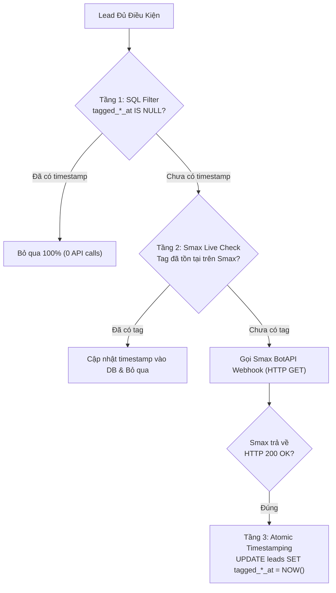

# Quy Tắc Gắn Tag Smax BotAPI & Cơ Chế Chống Lặp 3 Tầng (Idempotency)

## 1. Định Dạng Gọi BotAPI Webhook Chuẩn Smax
```http
GET https://api.smax.ai/public/bizs/{biz_alias}/triggers/{trigger_id}?customer={"id":"<TID>","page_id":"<PAGE_PID>"}&attrs=[{"name":"...","value":"..."}]&access_token=<JWT_TOKEN>
```
* Bắt buộc cả 2 tham số `customer` và `attrs` phải được bọc `JSON.stringify()` và mã hóa `encodeURIComponent()`.

---

## 2. Kiến Trúc 3 Tầng Bảo Vệ Chống Trùng Lặp (3-Layer Idempotency)

Mục tiêu: Đảm bảo **mỗi khách hàng chỉ bị gọi BotAPI đúng 1 lần duy nhất**, không spam hệ thống Smax, không tụt điểm Quality Rating WhatsApp.



### Điều kiện gắn từng thẻ:
1. **Tag "Thành công" (`thanh_cong`)**:
   - `conversation_result = 'Đã chốt đơn'` VÀ `tagged_success_at IS NULL`.
2. **Tag "Có nhu cầu" (`co_nhu_cau`)**:
   - `customer_messages >= 3` VÀ `conversation_result != 'Đã chốt đơn'` VÀ `tagged_demand_at IS NULL`.
