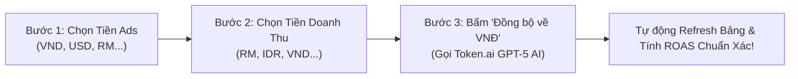

# Hướng Dẫn Đồng Bộ Tiền Tệ & Chuẩn Hóa ROAS Về VNĐ Bằng Token.ai GPT-5

Tài liệu hướng dẫn vận hành tính năng **Đồng Bộ Tiền Tệ Đa Quốc Gia (Currency Synchronization & ROAS Normalization Engine)** trên hệ thống Mini-CRM Smax WhatsApp.

---

## 1. Vấn Đề Thực Tế (The Problem)

Khi vận hành bán hàng trên thị trường quốc tế (Cross-border E-commerce):
- **Tài khoản Quảng cáo Meta Ads**: Doanh nghiệp thường dùng tài khoản tiền **Việt Nam Đồng (VNĐ)** hoặc **Đô La Mỹ (USD)** để thanh toán với Meta.
- **Doanh thu Thu Hộ (COD) trên CRM**: Khách hàng chốt đơn tại nước sở tại bằng đồng tiền địa phương (ví dụ: Malaysia thu **RM / MYR**, Indonesia thu **IDR / Rupiah**, Thái Lan thu **THB / Baht**).
- **Hệ quả**: Nếu lấy trực tiếp Doanh thu chia cho Chi phí (ví dụ: `537 RM / 816,261 VND` hoặc `1,000,000 IDR / $50 USD`), chỉ số **ROAS** và **CPA** sẽ bị sai lệch hoàn toàn, không thể đánh giá được hiệu quả chiến dịch!

---

## 2. Quy Trình 3 Bước Đồng Bộ Tiền Tệ Trên Mini-CRM

Trong Tab **"Báo Cáo Hiệu Quả & ROAS Theo Ads Campaign"**, người dùng chỉ cần thực hiện 3 bước đơn giản:



### Bước 1: Chọn Đơn Vị Tiền Tài Khoản Ads (Spend)
- Bấm nút **"💱 Đồng Bộ Tiền Tệ"** trên thanh tiêu đề của Tab Báo Cáo Ads Campaign.
- Chọn loại tiền Meta Ads trừ phí:
  - 🇻🇳 `VND - Việt Nam Đồng (₫)` (Mặc định cho tài khoản Ads Việt Nam)
  - 🇺🇸 `USD - Đô La Mỹ ($)`
  - 🇲🇾 `RM - Ringgit Malaysia (RM)`
  - 🇮🇩 `IDR - Rupiah Indonesia (Rp)`
  - 🇹🇭 `THB - Baht Thái Lan (฿)`
  - 🇸🇬 `SGD - Singapore Dollar (S$)`
  - 🇵🇭 `PHP - Peso Philippines (₱)`

### Bước 2: Chọn Đơn Vị Tiền Doanh Thu CRM (Orders)
- Chọn loại tiền thu hộ COD của các đơn hàng trong dự án:
  - 🇲🇾 `RM - Ringgit Malaysia (RM)` (Ví dụ: Dự án Fitgum)
  - 🇮🇩 `IDR - Rupiah Indonesia (Rp)`
  - 🇻🇳 `VND - Việt Nam Đồng (₫)`
  - 🇺🇸 `USD - Đô La Mỹ ($)`
  - 🇹🇭 `THB - Baht Thái Lan (฿)`

### Bước 3: Bấm Nút "Đồng Bộ Về VNĐ (Tỷ Giá Token.ai AI)"
- Hệ thống gửi yêu cầu tới serverless function `api/currency-sync.js`.
- Endpoint gọi **Token.ai AI Server** (`https://token.ai.vn/v1`, Model `gpt-5`) để lấy tỷ giá thị trường thực tế mới nhất:
  - Ví dụ: `1 RM ≈ 5,900 VNĐ | 1 VND = 1 VNĐ`.
  - Hoặc: `1 USD ≈ 25,450 VNĐ | 1 IDR ≈ 1.58 VNĐ`.
- Cập nhật tỷ giá vào database Neon (`projects` table).
- Giao diện Mini-CRM **tự động Refresh** ngay lập tức. Toàn bộ bảng số liệu, chi phí, doanh thu, CPA, CPL và ROAS được hợp nhất về đồng tiền chung là **VNĐ**.

---

## 3. Công Thức Tính Toán ROAS & CPA Sau Khi Chuẩn Hóa

Sau khi hợp nhất về VNĐ:
1. **Tổng Chi Phí Ads (Spend VNĐ)**:
   $$\text{Spend}_{\text{VND}} = \text{Spend}_{\text{Ads}} \times \text{Rate}_{\text{Ads} \to \text{VND}}$$
2. **Tổng Doanh Thu Đơn Chốt (Revenue VNĐ)**:
   $$\text{Revenue}_{\text{VND}} = \text{Revenue}_{\text{CRM}} \times \text{Rate}_{\text{Rev} \to \text{VND}}$$
3. **Chỉ Số ROAS Chính Xác (Return On Ad Spend)**:
   $$\text{ROAS} = \frac{\text{Revenue}_{\text{VND}}}{\text{Spend}_{\text{VND}}}$$
   *(Ví dụ Fitgum: Doanh thu 3,168,300 ₫ / Chi phí 816,261 ₫ = **3.88x ROAS**).*
4. **Chi Phí Trên Mỗi Đơn Chốt (Blended CPA)**:
   $$\text{CPA}_{\text{VND}} = \frac{\text{Spend}_{\text{VND}}}{\text{Tổng Số Đơn Chốt COD}}$$
5. **Chi Phí Trên Mỗi Lead (Blended CPL)**:
   $$\text{CPL}_{\text{VND}} = \frac{\text{Spend}_{\text{VND}}}{\text{Tổng Số Khách Nhắn Tin WhatsApp}}$$

---

## 4. Chế Độ Chuyển Đổi Hiển Thị (Toggle View)

Giao diện tích hợp công tắc chuyển đổi nhanh:
- **`[VNĐ]` (Mặc định)**: Hiển thị toàn bộ bằng số tiền Việt Nam Đồng kèm chú thích tiền tệ gốc nhỏ bên dưới (e.g. `3,168,300 ₫ (Gốc: 537 RM)`).
- **`[Gốc]`**: Hiển thị số liệu theo đơn vị tiền tệ nguyên bản của từng nền tảng (Spend theo tiền Ads, Revenue theo tiền COD).

---

## 5. Cấu Trúc Bảng Database Neon & API Endpoint

### Cột bổ sung trong bảng `projects`:
```sql
ALTER TABLE projects 
ADD COLUMN IF NOT EXISTS ads_currency VARCHAR(10) DEFAULT 'VND',
ADD COLUMN IF NOT EXISTS revenue_currency VARCHAR(10) DEFAULT 'RM',
ADD COLUMN IF NOT EXISTS rate_ads_to_vnd NUMERIC(15, 6) DEFAULT 1.0,
ADD COLUMN IF NOT EXISTS rate_rev_to_vnd NUMERIC(15, 6) DEFAULT 5900.0,
ADD COLUMN IF NOT EXISTS currency_synced_at TIMESTAMPTZ,
ADD COLUMN IF NOT EXISTS currency_sync_note TEXT;
```

### Endpoint Vercel Serverless: `POST /api/currency-sync`
**Payload yêu cầu:**
```json
{
  "project_id": "fitgum",
  "ads_currency": "VND",
  "revenue_currency": "RM"
}
```

**Phản hồi thành công từ Token.ai GPT-5:**
```json
{
  "success": true,
  "message": "Đã đồng bộ đơn vị tiền tệ và chuẩn hóa về VNĐ thành công (Token.ai GPT-5).",
  "project_id": "fitgum",
  "ads_currency": "VND",
  "revenue_currency": "RM",
  "target_currency": "VND",
  "rate_ads_to_vnd": 1.0,
  "rate_rev_to_vnd": 5900.0,
  "currency_synced_at": "2026-10-01T12:33:21.020Z",
  "note": "1 RM ≈ 5,900 VNĐ | 1 VND = 1 VNĐ (Token.ai GPT-5)",
  "source": "Token.ai GPT-5"
}
```
